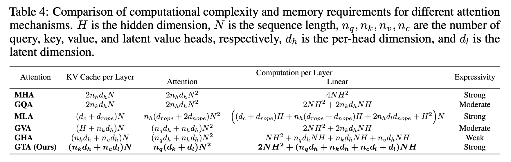

# RooflineBench

This project is mainly used to test the upper limit of LLM's inference performance on the device

> A new version of this project, updated alongside the paper, is available at [RooflineDiag](https://github.com/HuzhouNLP/RooflineDiag).

<br>

# Test Device Memory Access Bound & Computation Bound

`utils/bandwidth_test_utils.py`

<br>

# Roofline Analysis

`plot_device_roofline/plot_device_roofline_m1pro.py`


# Calculate inference flops

`utils/cal_flops_utils.py`

Mainly focus on the flops of different types of attention in the reasoning stage.



Citation：https://arxiv.org/abs/2506.17286 Table 4.

<br>

**The calculation-related parameters need to be specified in the `model_info` in `test_inference/config.json`.**

**Please obtain these parameters from the model card or model config.**

```json
"model_info":
{
"attention_type": "GQA",
"hidden_size": 1536,
"num_attention_heads": 12,
"num_hidden_layers": 28,
"num_key_value_heads": 2,
"is_modified_arch": false
}
```

<br>

This utils can be called directly and the return value will be in json format.

Example.

```python
  common_params = {
      # - Number of Attention Heads (GQA): 12 for Q and 2 for KV
      'attention_type': 'GQA',
      'num_hidden_layers': 28,
      'p_tokens': 128, # Test n-prompt
      'hidden_size': 1536, # "hidden_size": 1536
      # number of Attention Heads (GQA): 12 for Q and 2 for KV
      # nq = 12 nk = nv = 1
      'num_attention_heads': 12, # "num_attention_heads": 12
      'num_key_value_heads': 2, # "num_key_value_heads": 2
  }
  print(common_params)
  calculator = AttentionFlopsCalculator()
  calculator.set_params(**common_params)
  flops_dict = calculator.cal_flops()
  print(flops_dict)
```

<br>

# Inference Test

**This project requires calling llama-bench through the command line. Please install [llama.cpp](https://github.com/ggml-org/llama.cpp) first.**

macOS / Linux

```bash
brew install llama.cpp
```

Windows

```bash
winget install llama.cpp
```

<br>

`config.json`

The relevant configuration files will be read during the test.

```json
{
  "log_dir": "~/Code/llm_inference_roofline_detect/log",
  "analysis_dir": "~/Code/llm_inference_roofline_detect/analysis",
  "threads": 1,
  "model_name": "Qwen2.5-1.5B-Instruct",
  "model_type": "qwen2 f16",
  "model_path": "~/Code/llm_inference_roofline_detect/models/Qwen2.5-1.5B-Instruct-f16.gguf",
  "model_info":
  {
    "attention_type": "GQA",
    "hidden_size": 1536,
    "num_attention_heads": 12,
    "num_hidden_layers": 28,
    "num_key_value_heads": 2,
    "is_modified_arch": false
  }
}
```

<br>

`inference.py`

You can use other Python command line parameters to call and execute single inference.

```python
# Timestamp can be obtained like this
timestamp = DateTimeUtils.get_current_timestamp()

def single_inference(log_dir: str, model_path:str, threads: int, p_tokens: int, n_tokens: int, timestamp: str):

if __name__ == "__main__":
    parser = argparse.ArgumentParser(description="Run a single inference with specified parameters.")
    parser.add_argument("--log_dir", type=str, required=True, help="Directory to save logs.")
    parser.add_argument("--model_path", type=str, required=True, help="Path to the model file.")
    parser.add_argument("--threads", type=int, required=True, help="Number of threads to use for inference.")
    parser.add_argument("--p_tokens", type=int, required=True, help="Number of prompt tokens.")
    parser.add_argument("--n_tokens", type=int, required=True, help="Number of generated tokens.")
    parser.add_argument("--timestamp", type=str, required=False, help="Timestamp for logging purposes.")

    args = parser.parse_args()

    try:
        single_inference(args.log_dir,args.model_path, args.threads, args.p_tokens, args.n_tokens, args.timestamp)
    except Exception as e:
        print(f"Error during inference: {e}", file=sys.stderr)
        sys.exit(1)
```

<br>

`monitor_inference_memory`

Call `inference.py` by passing in command line parameters. 

The return format is the absolute path address dictionary of `inference_${timestamp}.json` `memory_usage_${timestamp}.log` `runtime_${timestamp}.txt`, which is convenient for further analysis. The three timestamps are consistent and are generated by a single monitor.

Example.

```python
def monitor_inference_memory(config: Config, p_tokens: int, n_tokens: int) -> dict | None:
  
log_path_dict = monitor_inference_memory(ConfigUtils.load_config("config.json"), p_tokens=512, n_tokens=128)
```

<br>

`analyze_inference.py`

Perform inference and analyze the results.

Example.

```python
def single_inference_analysis(config: Config, p_tokens: int, n_tokens: int, save_json:bool = True) -> str:

# single inference analysis
p_tokens = 512
n_tokens = 128
config_path = "config.json"
config = ConfigUtils.load_config(config_path)

analysis_json = single_inference_analysis(config=config, p_tokens=p_tokens, n_tokens=n_tokens)
analysis_dict = json.loads(analysis_json)[0]
total_flops = analysis_dict["total_flops"]
flops_per_token = analysis_dict['flops_per_token']
peak_mem = analysis_dict['peak_memory_kb']
mem_traffic = analysis_dict['memory_traffic_kb']
runtime = analysis_dict['runtime']
oi = analysis_dict['operational_intensity']
perf = analysis_dict['performance']
print(f"Total FLOPs: {total_flops:.2f}")
print(f"FLOPs Per Token: {flops_per_token:.2f}")
print(f"Peak DRAM (MB): {peak_mem / 2**10:.2f}")
print(f"DRAM Traffic (MB): {mem_traffic / 2**10:.2f}")
print(f"Inference Time (s): {runtime:.2f}")
print(f"Operational Intensity (FLOPs/Byte): {oi:.2f}")
print(f"Performance (GFLOPs/s): {perf / 10 ** 9:.2f}")
```

Also supports batch inference testing and analysis of results.

Example.

```python
def batch_inference_analysis(config: Config, p_tokens_list: list, n_tokens_list: list, save_json=True) -> str:

# batch inference analysis
n_tokens_list = [128, 128, 4096, 4096]
p_tokens_list = [128, 4096, 128, 4096]
config_path = "config.json"
config = ConfigUtils.load_config(config_path)

batch_analysis_json = batch_inference_analysis(config=config, p_tokens_list=p_tokens_list, n_tokens_list=n_tokens_list)
```


