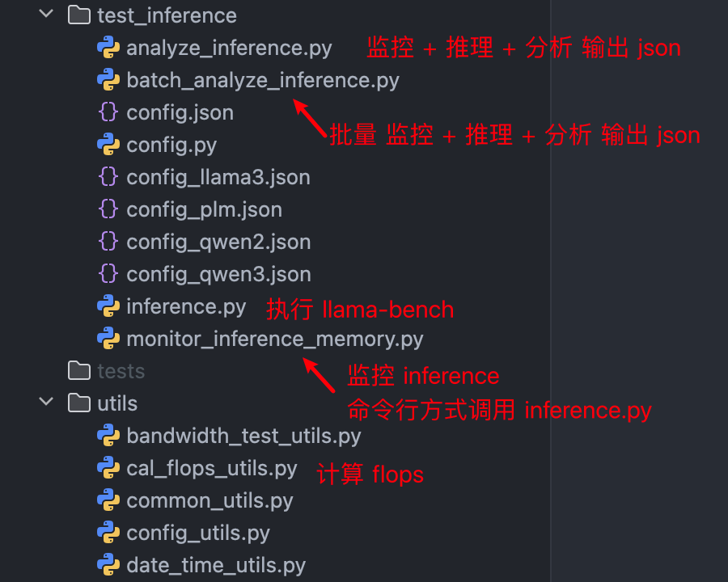
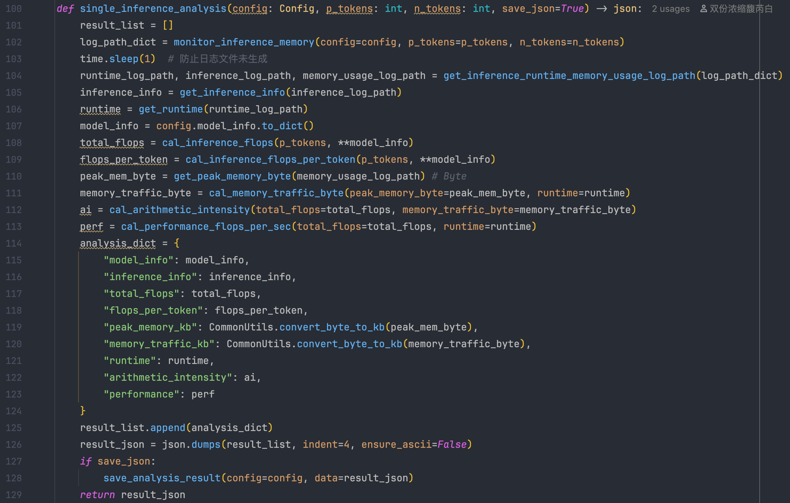
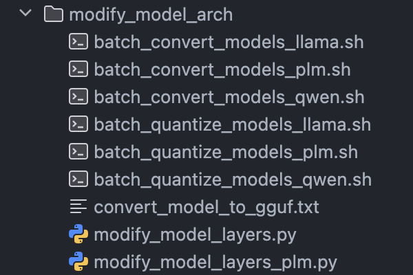

# 代码结构说明



<br>

# 代码思路说明 & 需要关注的地方

## `inference.py`

在 main 接受命令行参数 传入参数调用 llama-bench

==需要先使用 homebrew 安装 llama.cpp==

```bash
brew install llama.cpp
```

<br>

```python
if __name__ == "__main__":
    parser = argparse.ArgumentParser(description="Run a single inference with specified parameters.")
    parser.add_argument("--log_dir", type=str, required=True, help="Directory to save logs.")
    parser.add_argument("--model_path", type=str, required=True, help="Path to the model file.")
    parser.add_argument("--threads", type=int, required=True, help="Number of threads to use for inference.")
    parser.add_argument("--p_tokens", type=int, required=True, help="Number of prompt tokens.")
    parser.add_argument("--n_tokens", type=int, required=True, help="Number of generated tokens.")
    parser.add_argument("--timestamp", type=str, required=False, help="Timestamp for logging purposes.")

    args = parser.parse_args()

    try:
        single_inference(args.log_dir,args.model_path, args.threads, args.p_tokens, args.n_tokens, args.timestamp)
    except Exception as e:
        print(f"Error during inference: {e}", file=sys.stderr)
        sys.exit(1)
```

<br>

## `monitor_inference_memory.py`

通过命令行参数调用`inference.py`后使用`llama-bench`匹配pid监控进程

内存使用情况会记录到 log dir

<br>

## `utils/cal_flops_utils.py`


==54行：计算 kv_cache_per_layer 核心代码 与表格中公式对应==

```python
def calculate_kv_cache_per_layer(self, attention_type: str) -> float:
    if attention_type == "MHA" or attention_type == "GQA":
        kv_cache = 2 * self.nk * self.dh * self.N
    elif attention_type == "MLA":
        kv_cache = (self.dc + self.drope) * self.N
    elif attention_type == "GVA":
        kv_cache = (self.H + self.nk * self.dh) * self.N
    elif attention_type == "GHA":
        kv_cache = (self.nk * self.dh + self.nv * self.dh) * self.N
    elif attention_type == "GTA":
        kv_cache = (self.nk * self.dh + self.nc * self.dl) * self.N
    else:
        raise ValueError(f"未知注意力类型: {attention_type}")
    return kv_cache
```


==69行：计算 flops_per_layer 核心代码 与表格中公式对应==

```python
def calculate_computation_per_layer(self, attention_type: str) -> tuple:
    if attention_type == "MHA":
        # MHA: Attention=(2*nh*dh*N^2), Linear=(4*N*H^2)
        attention_flops = 2 * self.nh * self.dh * (self.N ** 2)
        linear_flops = 4 * self.N * (self.H ** 2)
    elif attention_type == "GQA":
        # GQA: Attention=(2*nh*dh*N^2), Linear=(2*N*H^2 + 2*nk*dh*N*H)
        attention_flops = 2 * self.nh * self.dh * (self.N ** 2)
        linear_flops = 2 * self.N * (self.H ** 2) + 2 * self.nk * self.dh * self.N * self.H
    elif attention_type == "MLA":
        # MLA: Attention=(nh(drope+2*dnope)*N^2), Linear=((dc+drope)*H + nh*(drope+dnope)*H + 2*nh*dl*dnope + H^2)*N)
        attention_flops = self.nh * (self.drope + 2*self.dnope) * (self.N**2)
        linear_flops = ((self.dc + self.drope) * self.H + self.nh * (self.drope + self.dnope) * self.H + 2 * self.nh * self.dl * self.dnope + self.H ** 2) * self.N
    elif attention_type == "GVA":
        # GVA: Attention=((nq*dh + nk*dh)*N^2), Linear=(2*N*H^2 + 2*nk*dh*N*H)
        attention_flops = (self.nq * self.dh + self.nk * self.dh) * (self.N ** 2)
        linear_flops = 2 * self.N * (self.H ** 2) + 2 * self.nk * self.dh * self.N * self.H
    elif attention_type == "GHA":
        # GHA: Attention=((nq*dh + nh*dh)*N^2), Linear=(N*H^2 + nq*dh*N*H + nk*dh*N*H + nv*dh*N*H)
        attention_flops = (self.nq * self.dh + self.nh * self.dh) * (self.N ** 2)
        linear_flops = self.N * (self.H ** 2) + self.nq * self.dh * self.N
    elif attention_type == "GTA":
        # GTA: Attention=(nq*(dk+dl)*N^2), Linear=(2*N*H^2 + (nq*dh + nk*dh + nc*dl + dl)*N*H)
        attention_flops = 2 * self.nk * self.dh * (self.N ** 2)
        linear_flops = 2 * self.N * (self.H ** 2) + (self.nq * self.dh + self.nk * self.dh + self.nc * self.dl + self.dl) * self.N * self.H
    else:
        raise ValueError(f"未知注意力类型: {attention_type}")
    return attention_flops, linear_flops
```

<br>

## `analyze_inference`

主要就是`single_inference_analysis()和batch_inference_analysis()`



==108行计算了 total flops==

==110行获取了 peak memory byte==（可以点进`CommonUtils.convert_kb_to_byte()`去看定义了单位转换）

```python
def get_peak_memory_byte(log_path: str) -> float:
    return CommonUtils.convert_kb_to_byte(CommonUtils.find_csv_max(log_path))
```

==111行计算了 memory traffic byte==

==112行计算了 arithmetic intensity==

==113行计算了 performance（flops / second）==

然后把这些全变成 json 返回

因为`batch_inference_analysis()`中调用了`single_inference_analysis()`

```python
def batch_inference_analysis(config: Config, p_tokens_list: list, n_tokens_list: list, save_json=True) -> json:
    result_list = []
    if len(p_tokens_list) != len(n_tokens_list):
        raise ValueError("p_tokens_list 和 n_tokens_list 必须长度相同")
    for p_token, n_token in zip(p_tokens_list, n_tokens_list):
        analysis_json = single_inference_analysis(config=config, p_tokens=p_token, n_tokens=n_token, save_json=False)
        analysis_list = json.loads(analysis_json)
        result_list.append(analysis_list[0])
    result_json = json.dumps(result_list, indent=4, ensure_ascii=False)
    if save_json:
        save_analysis_result(config=config, data=result_json)
    return result_json
```

所以有个 save_json 参数

就是 batch 中调 single 我不需要每次都保存 我需要他给我 batch analysis 后统一保存

`result_list.append(analysis_list[0])`是为了保证 single 和 batch 情况下数据格式一致 都是一个 json list

<br>

## `batch_analyze_inference.py`

就是普普通通的循环

例如下面的传个 config 进去可以批量完成对单一模型不同层数四种情况的批量实验

```python
def qwen2_batch_inference_analysis(config: Config, p_tokens_list: list, n_tokens_list: list):
    # Qwen2.5-1.5B-Instruct
    config.model_name = "Qwen2.5-1.5B-Instruct"
    config.model_info.hidden_size = 1536
    config.model_info.num_attention_heads = 12
    config.model_info.num_key_value_heads = 2

    model_dir = os.path.dirname(config.model_path)

    for layer in range(16, 33, 2):
        model_name = f"{config.model_name}-{layer}-layers-f16.gguf"
        next_model_path = os.path.join(model_dir, model_name)
        config.model_path = next_model_path
        config.model_info.num_hidden_layers = layer
        print(f"Running batch inference analysis for {layer} layers...")
        batch_inference_analysis(config=config, p_tokens_list=n_tokens_list, n_tokens_list=p_tokens_list)
    print(f"Finished running batch inference analysis for {config.model_name}.")

    for layer in range(16, 33, 2):
        model_name = f"{config.model_name}-{layer}-layers-q8_0.gguf"
        next_model_path = os.path.join(model_dir, model_name)
        config.model_path = next_model_path
        config.model_info.num_hidden_layers = layer
        print(f"Running batch inference analysis for {layer} layers...")
        batch_inference_analysis(config=config, p_tokens_list=n_tokens_list, n_tokens_list=p_tokens_list)
    print(f"Finished running batch inference analysis for {config.model_name}.")

    for layer in range(16, 33, 2):
        model_name = f"{config.model_name}-{layer}-layers-q4_k_m.gguf"
        next_model_path = os.path.join(model_dir, model_name)
        config.model_path = next_model_path
        config.model_info.num_hidden_layers = layer
        print(f"Running batch inference analysis for {layer} layers...")
        batch_inference_analysis(config=config, p_tokens_list=n_tokens_list, n_tokens_list=p_tokens_list)
    print(f"Finished running batch inference analysis for {config.model_name}.")
```

<br>

# 模型格式转换 & 量化



先跑`modify_model_layers.py`生成16～32层模型

`batch_convert_models_xxx.sh`是用来把生成的模型批量转换成 fp16 q8_0 的 gguf

==确保已经有llama.cpp repo 并且有一个名字叫 llama.cpp 的 conda 环境 并且已经安装了所有 requirements==

`batch_quantize_models_xxx.sh`是用来把 fp16 转换成 q4_k_m 的gguf（因为llama.cpp转格式的时候没有 q4_k_m 参数）