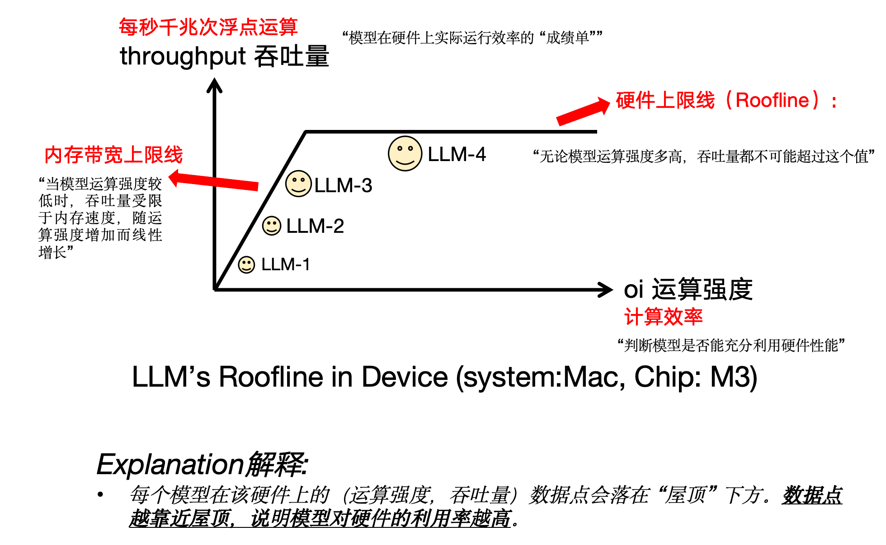
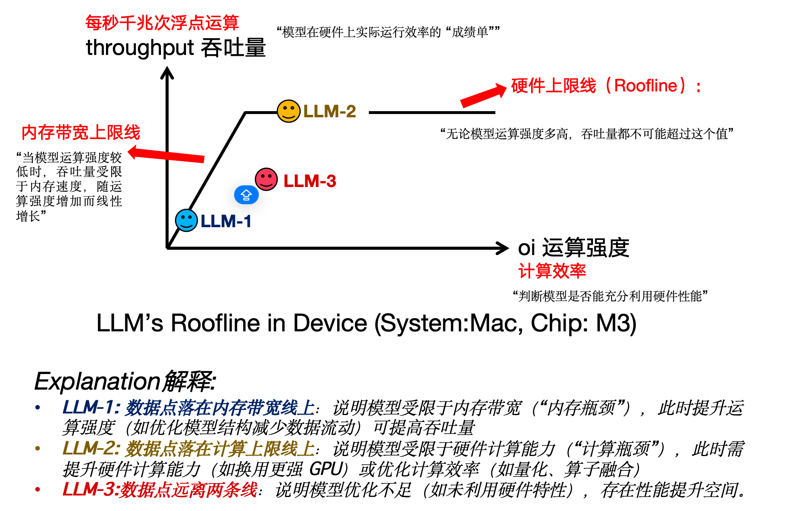
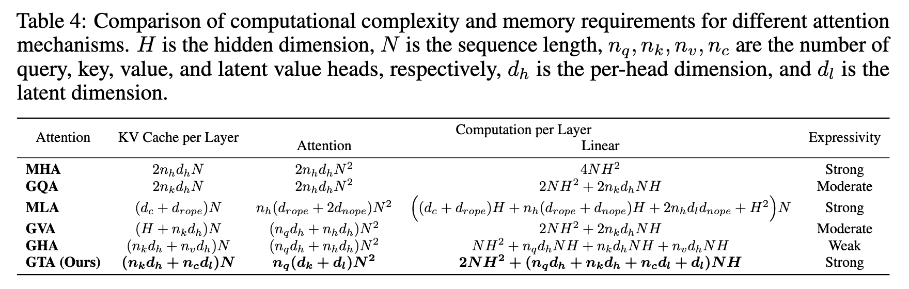
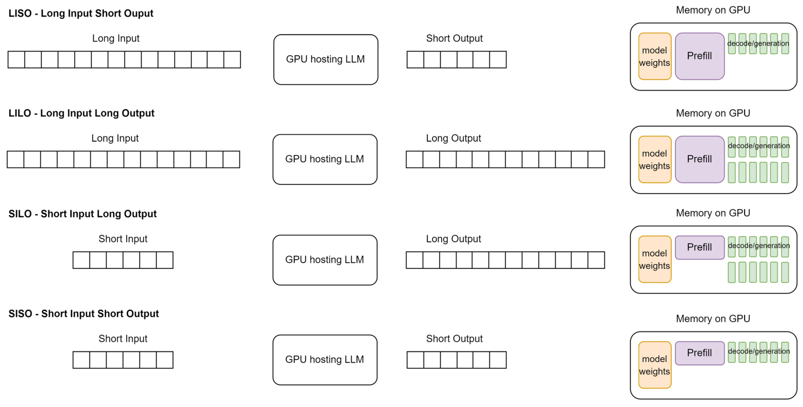
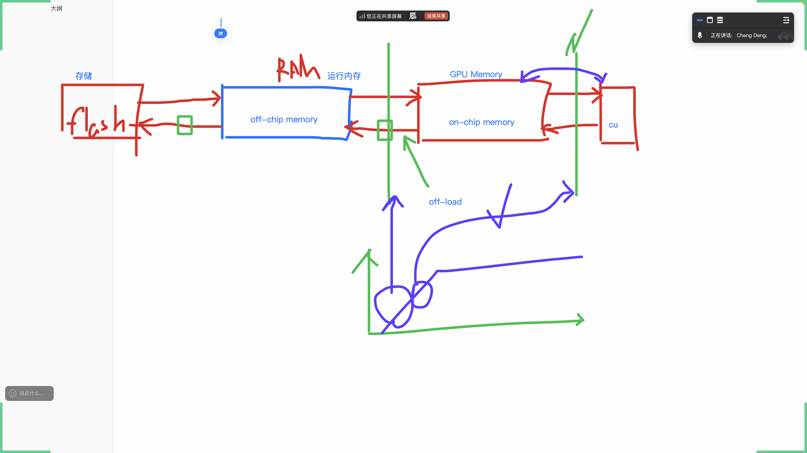

# LLM Reasoning Roofline Explanation

# Cal Flops

https://arxiv.org/abs/2506.17286

Table 4

#  LLM 长短输入输出（LISO, LILO, SILO, SISO）

> 1.  **LISO (Long Input Short Output)**：长输入，短输出。
>     * 在GPU内存中，"Prefill"（预填充）阶段需要占用大量的空间来处理长输入。
>     * "Decode/Generation"（解码/生成）阶段，由于输出较短，占用的空间相对较少。
>
> 2.  **LILO (Long Input Long Output)**：长输入，长输出。
>     * "Prefill"（预填充）阶段需要大量的GPU内存来处理长输入。
>     * "Decode/Generation"（解码/生成）阶段也需要大量的GPU内存来处理长输出。
>     * 这是四种情况中对GPU内存需求最大的情况。
>
> 3.  **SILO (Short Input Long Output)**：短输入，长输出。
>     * "Prefill"（预填充）阶段，由于输入较短，占用的内存较少。
>     * "Decode/Generation"（解码/生成）阶段，由于输出较长，占用的内存较多。
>
> 4.  **SISO (Short Input Short Output)**：短输入，短输出。
>     * "Prefill"（预填充）阶段和"Decode/Generation"（解码/生成）阶段都只需要少量的GPU内存。
>     * 这是四种情况中对GPU内存需求最小的情况。
>
> 总的来说，这张图清晰地展示了：
>
> * **输入长度**主要影响预填充（Prefill）阶段的内存消耗。
> * **输出长度**主要影响解码/生成（Decode/Generation）阶段的内存消耗。
> * **GPU内存**的分配需要同时考虑模型权重、预填充和解码/生成这三个部分。不同的输入输出组合会导致GPU内存资源的分配模式显著不同。

# 推理上限示意

